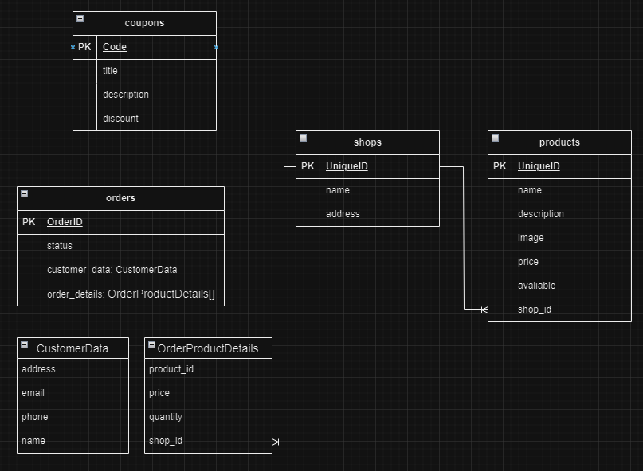

**#  medicine-delivery-app**

Web application where users can order medicines delivery. Test task from ElifTech.

**### Environment Variables**

**Important:**  Set the required environment variables before starting the application. You can find an example configuration file in `.env_example`. Rename it to `.env` and populate it with your specific values.

**### Running the Application**

The project consists of a client-side and server-side application. Follow the steps below to run each component:

**Client**

1. Navigate to the client directory:

   ```bash
   cd ./client/
   ```

2. Install dependencies:

   ```bash
   npm install
   ```

3. Start the development server:

   ```bash
   npm run dev
   ```

**Server**

1. Navigate to the server directory:

   ```bash
   cd ./server/
   ```

2. Install dependencies:

   ```bash
   npm install
   ```

3. Start the development server:

   ```bash
   npm run dev
   ```

**## Database Structure**

The application uses a database with the following structure:


